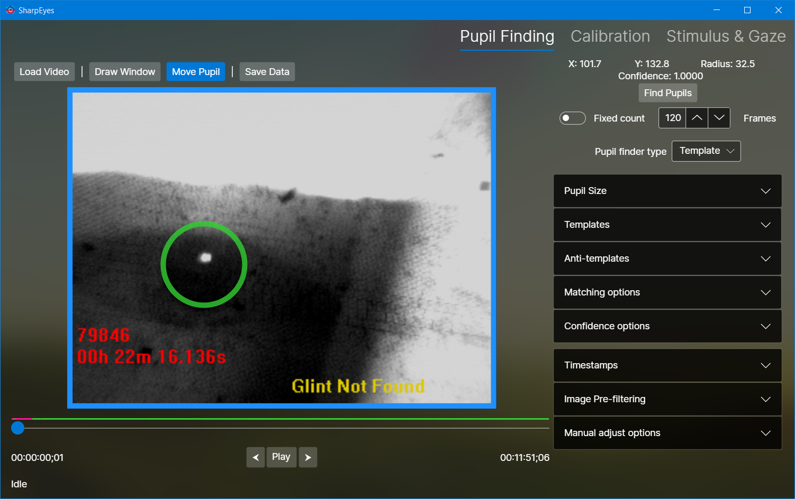

# SharpEyes
A companion to (and eventual replacement for) the [Eyetracking](https://github.com/gallantlab/Eyetracking) python package. 
SharpEyes offers a UI for finding pupils in eyetracking videos, and the ability to edit the pupil locations manually, 
which is way better than the Eyetracking package way of setting values and hoping for the best.

See the [wiki](https://github.com/candytaco/SharpEyes/wiki) for more information.

As of Feb 10, 2021, this is extremely an work in progress, and only the most basic functionalities are supported. These are:
* Loading a video
* Parsing timestamps
* Filtering the image before finding the pupil
* Using templates to find the pupil (Hough circles exist, but I haven't really done much about it)
  * Selecting a part of the video to use as a custom template
* Scrubbing through the video
* Manually adjusting the found pupil locations
* Saving out the found pupil locations to a .npy file to be parsed by the Eyetracking package.
* Reading in files that this saved.

Most exceptions have been handled. However, some of the fixes are bad batches that simply prevent the program from crashing.
There are probably many more insidious silent bugs that corrupt the data.
I recommend restarting the program every time you process a video to prevent weird data bleed overs.

## Current usage
1. Open a video
2. Read the timestamps
3. (Optional) Draw a window (green box) to limit the pupil finder to a part of the video
4. (Optional) move the pupil (blue circle) to the pupil and set a custom template
5. Find pupils (leave it on the tempate finder type. I have not debugged or added enough knobs for Hough to be useful.
6. Save pupil locations

### Things you can do:
* Clicking on "Draw window" enables window editing. You will have to do that every time you want to change the window
* Clicking once on "Move pupil" enters pupil editing mode. You can then click and draw to move the found pupil location around. Scrolling will change the pupil size. Click the button again to exit pupil editing.
* Clicking on "find pupils" will look through the next N frames (the number picker under the button sets N)
* Clicking on "Find pupils all frames" will get pupiled through the end of the video.
* Pupil finding can be cancelled using the "Cancel" button that shows up. Frames that have been processed will remain so.
* The template preview shows the current template that is being used.
* Scrolling over the video when not in "draw window" or "edit pupil" mode will scrub through the video frame-by-frame

### Things to know
#### Template pupil finding
* When using default templates, the pupil finder will get a pupil location _and_ radius. 
  * It does so using multiple templates, but the preview will only show the smallest template.
* When using a custom template, the pupil finder will report the radius from the frame from which the template was set.

#### Manual adjustments
When you move the pupil circle on a frame, SharpEyes computes the delta between the position you set, and the position that the pupil finder reported.
The position on that frame is updated to the position that you set.
On the frames following, SharpEyes updates the value in the direction of the delta in one of two ways:
* Linear fade: each successive frame is updated by a linearly decreasing amount. The number picker sets the number of frames to receive updates, and SharpEyes will compute the delta fading over frames.
* Exponential fade: each successive frame is updated by a exponentially decreasing amount. The number picker sets the half-life of the delta. SharpEyes will update frames until the delta decays to less than one pixel.

### Resources used
* [NumSharp Lite](https://github.com/SciSharp/NumSharp.Lite) for interop with NumPy
* [OpenCvSharp](https://github.com/shimat/opencvsharp) for video processing
* Icons8 application icon.

##### Requirements
This is targeted at .NET framework v4.6.1 and written/compiled/tested on Win10 20H2 and VS2017 Community.
